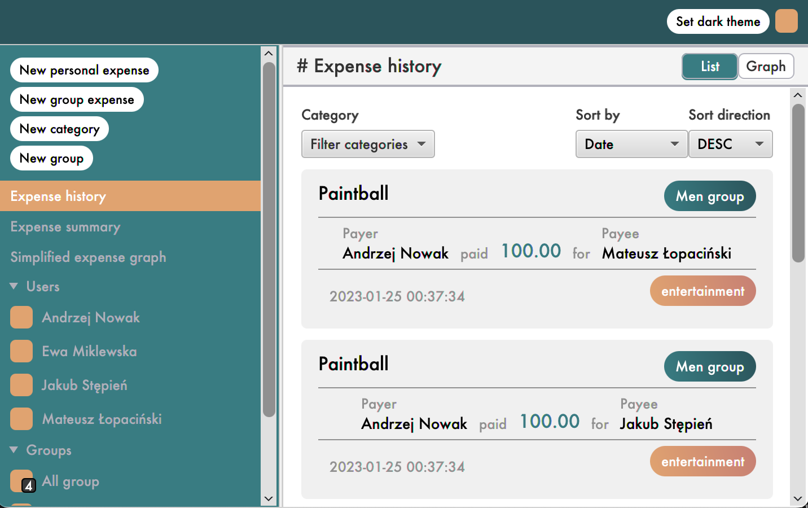
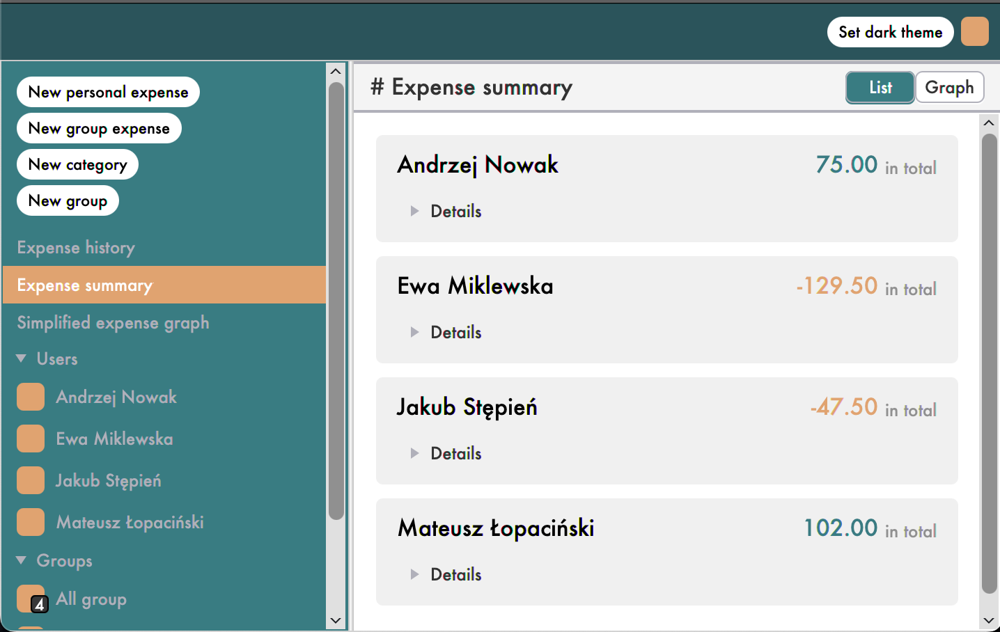
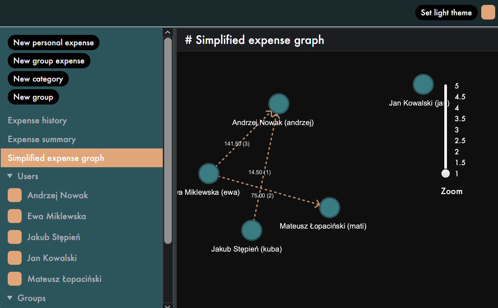

# DebtExecutor

## :pencil: Description

This project was created for the Object-Oriented Technologies subject at the AGH UST in 2022/2023.

The project is a simple app that helps people to track personal or group expenses and calculate the amount that needs to be paid back.

## :bulb: Functionalities

### Users and groups

- creating a new user account,
- logging in to an existing user account,
- creating groups of users (used to create a group expense)

### Expenses

- displaying a history of all expenses,
- sorting expenses by title, date or amount,
- filtering expenses by categories,
- displaying a graph containing all expenses
- creating a new personal expense (one user paid for an another user),
- creating group expenses (one user paid for a group of users - group must have been created before),
- creating a new expense category

### Summaries

- displaying expense summaries for each user as a list,
- displaying expense summaries graph

### Simplification of expenses

- displaying a simplified expenses graph (this graph is a simplification of all expenses and represents the minimum number of payments required to pay all debts of all users)

## :hammer: Core technology stack

### Client

- Java 17,
- JavaFX,
- Spring Boot,
- Retrofit

### Server

- Java 17,
- Spring Boot

## :woman::man: Contributors

- [Ewa Miklewska](https://github.com/Ewa-M),
- [Jakub Stępień](https://github.com/jkbstepien)

## :eyes: Showcase

### Auth forms

#### Sign in form

| Light mode                           | Dark mode                           |
| ------------------------------------ | ----------------------------------- |
|  |  |

#### Sign up form

| Light mode                           | Dark mode                           |
| ------------------------------------ | ----------------------------------- |
|  |  |

### Views

#### Expense history view

##### Expense list

| Light mode                                        | Dark mode                                        |
| ------------------------------------------------- | ------------------------------------------------ |
|  |  |

##### Expense filtering

| Light mode                                                          | Dark mode                                                          |
| ------------------------------------------------------------------- | ------------------------------------------------------------------ |
|  |  |

##### Expense sort by

| Light mode                                                        | Dark mode                                                        |
| ----------------------------------------------------------------- | ---------------------------------------------------------------- |
|  |  |

##### Expense sort direction

| Light mode                                                                      | Dark mode                                                                      |
| ------------------------------------------------------------------------------- | ------------------------------------------------------------------------------ |
|  |  |

##### Expense pagination

| Light mode                                                              | Dark mode                                                              |
| ----------------------------------------------------------------------- | ---------------------------------------------------------------------- |
|  |  |

##### Expense graph

| Light mode                                               | Dark mode                                               |
| -------------------------------------------------------- | ------------------------------------------------------- |
|  |  |

#### Expense summary view

##### Summaries list

| Light mode                                  | Dark mode                                  |
| ------------------------------------------- | ------------------------------------------ |
|  |  |

##### Summaries graph view

| Light mode                                         | Dark mode                                         |
| -------------------------------------------------- | ------------------------------------------------- |
|  |  |

#### Simplified expenses graph view

| Light mode                                                               | Dark mode                                                               |
| ------------------------------------------------------------------------ | ----------------------------------------------------------------------- |
|  |  |

### Forms

#### Create personal expense form

| Light mode                                                                | Dark mode                                                                |
| ------------------------------------------------------------------------- | ------------------------------------------------------------------------ |
|  |  |

#### Create group expense form

| Light mode                                                          | Dark mode                                                          |
| ------------------------------------------------------------------- | ------------------------------------------------------------------ |
|  |  |

#### Create category form

| Light mode                                                | Dark mode                                                |
| --------------------------------------------------------- | -------------------------------------------------------- |
|  |  |

#### Create group form

| Light mode                                          | Dark mode                                          |
| --------------------------------------------------- | -------------------------------------------------- |
|  |  |

### Others

#### User panel

| Light mode                                 | Dark mode                                 |
| ------------------------------------------ | ----------------------------------------- |
|  |  |
